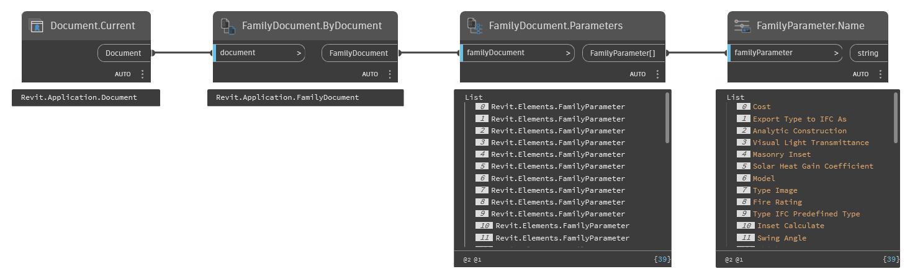

## In Depth
`FamilyParameter.Name` obtains the user visible name from the given family parameter element.

In the example below, the current Revit document is converted to a family document and all the parameters are obtained. `FamilyParameter.Name` is used to obtain the name from all the parameters in the family.
___
## Example File

