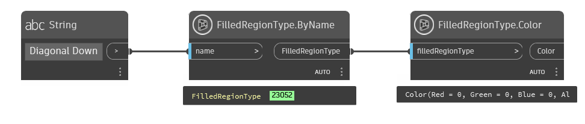

## In Depth
`FilledRegionType.Color` returns the color assigned to the given filled region type.

In the example below, the "Diagonal Down" filled region type is selected from the current Revit document. The color is then reported with `FilledRegionType.Color`.

___
## Example File

