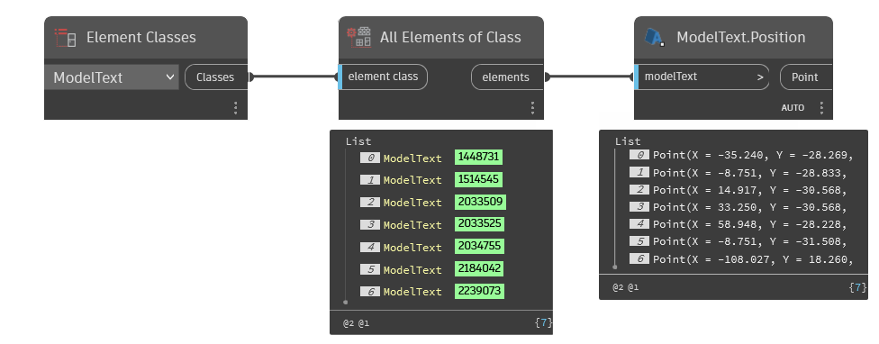

## In Depth
`ModelText.Position` returns the position of the given model text element as a Dynamo point.

In the example below, all model text is collected in the current Revit file. The locations are then returned with `ModelText.Position`.
___
## Example File

