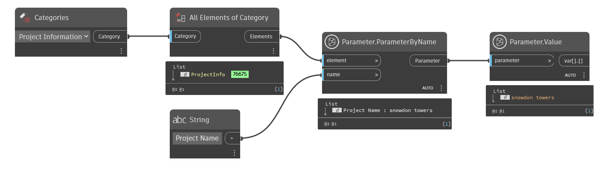

## In Depth
`Parameter.Value` returns the value of the given parameter (if available).

In the example below, all wall elements are collected from the current Revit document. The first wall is then selected, and it's parameter values are obtained. For any parameters without values, null is returned.
___
## Example File

