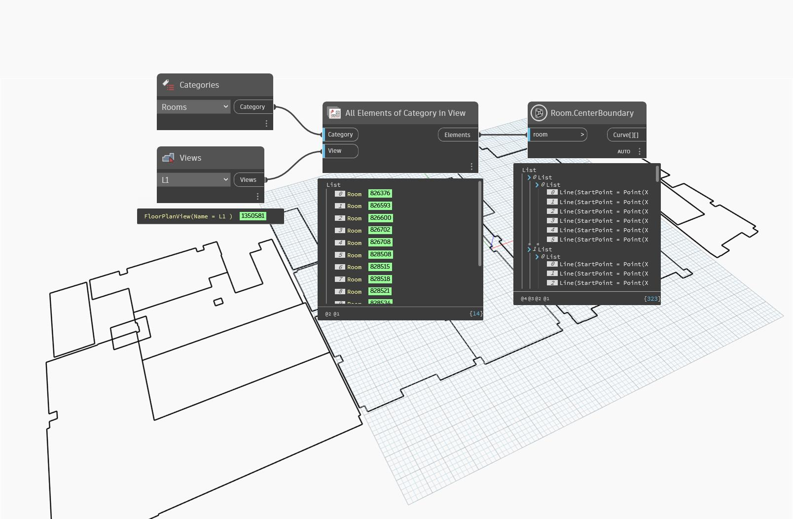

## In Depth
`Room.CenterBoundary` returns the center location line for all walls bounding the input room.

In the example below, the center location lines are obtained and previewed in blue.
___
## Example File

