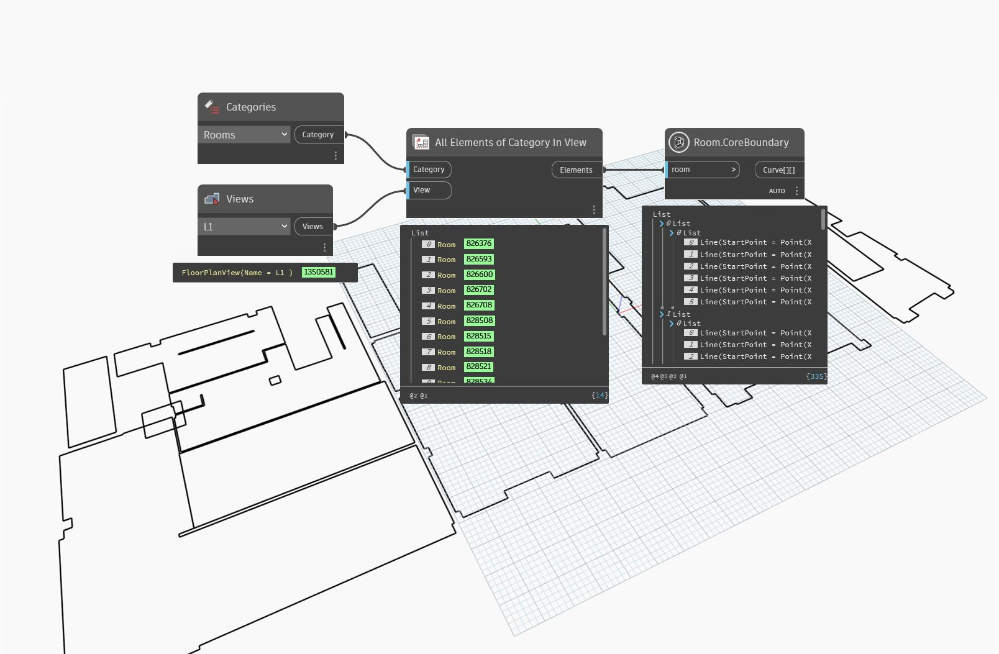

## In Depth
`Room.CoreBoundary` returns the core location line for all walls bounding the input room.

In the example below, the core location lines are obtained and previewed in green.
___
## Example File

