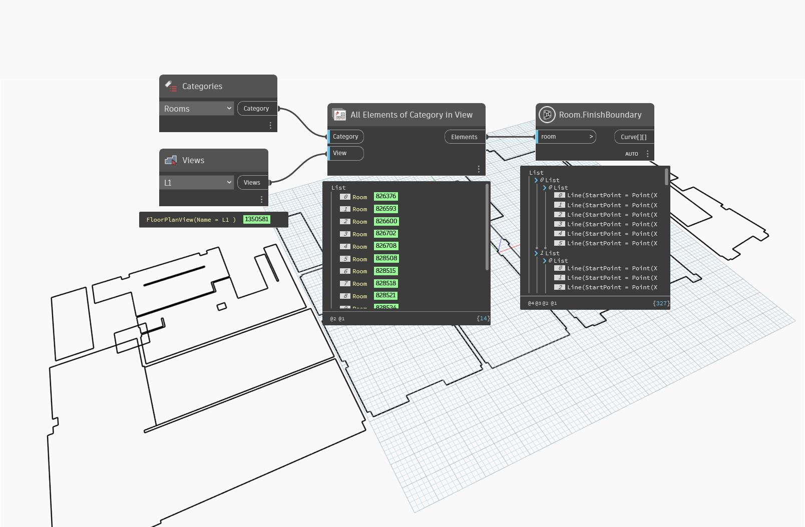

## In Depth
`Room.FinishBoundary` returns the finish location line for all walls bounding the input room.

In the example below, the finish location lines are obtained and previewed in orange.
___
## Example File

