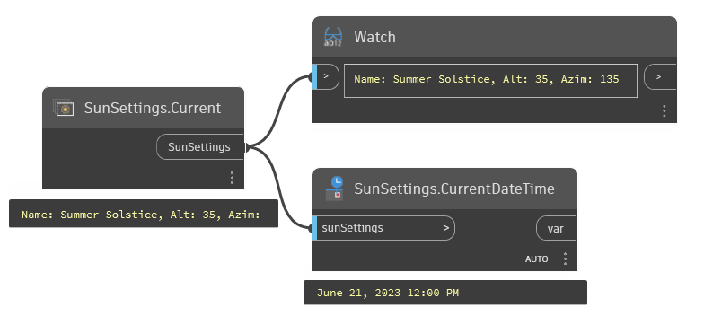

## In Depth
`SunSettings.CurrentDateTime` returns the current date and time for the given sun settings. Sun settings in Revit are modified in the view control bar in the user interface.

In the example below, the current sun settings are obtained, as well as the current date and time the sun settings are at.
___
## Example File

