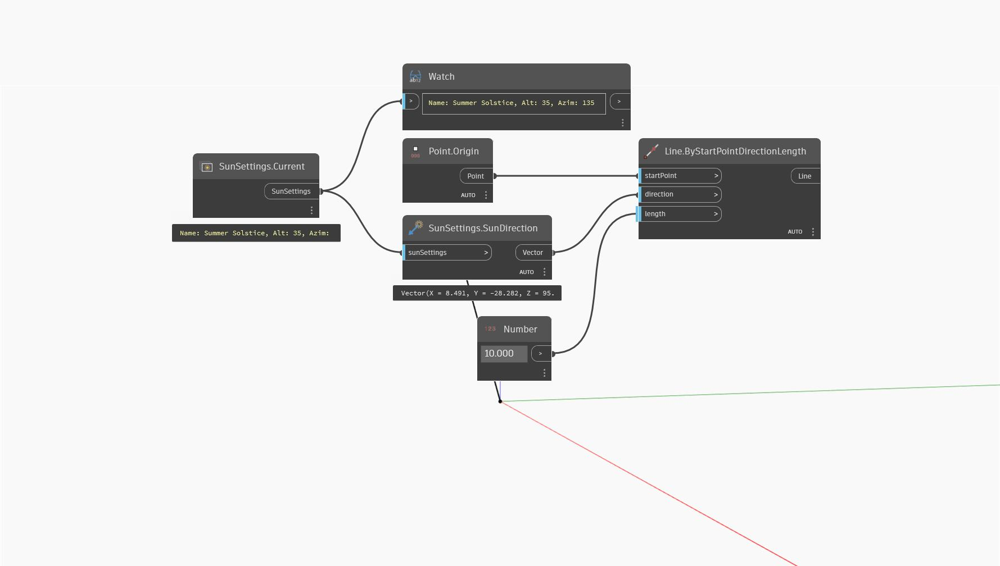

## In Depth
`SunSettings.SunDirection` returns the direction of the sun in the given sun settings as a vector.

In the example below, the sun direction is obtained from the active view's sun settings.
___
## Example File

