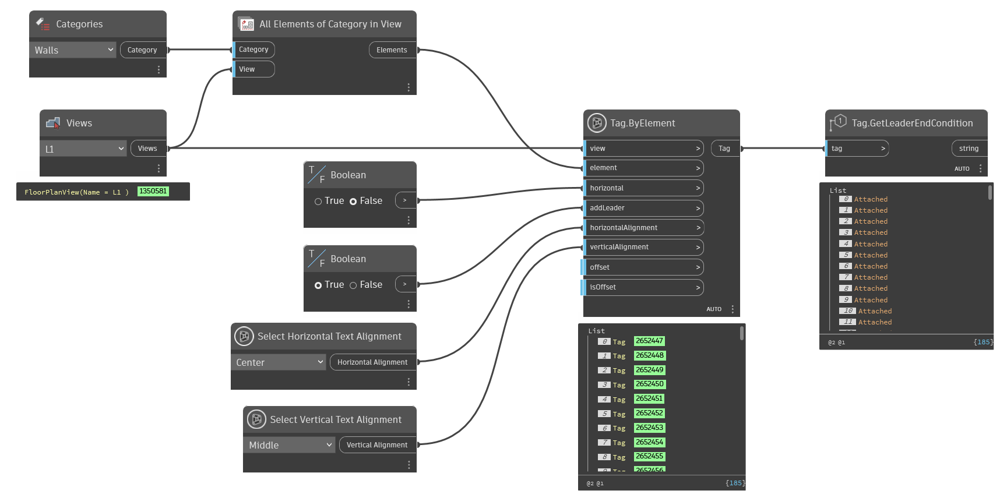

## In Depth
`Tag.GetLeaderEndCondition` returns the given tags leader end condition.

Possible end conditions include:
- Attached
- Free

In the example below, all keynote tags are collected from the "North Wall Window Detail" detail view. The tags' leader end conditions are then returned.

___
## Example File

