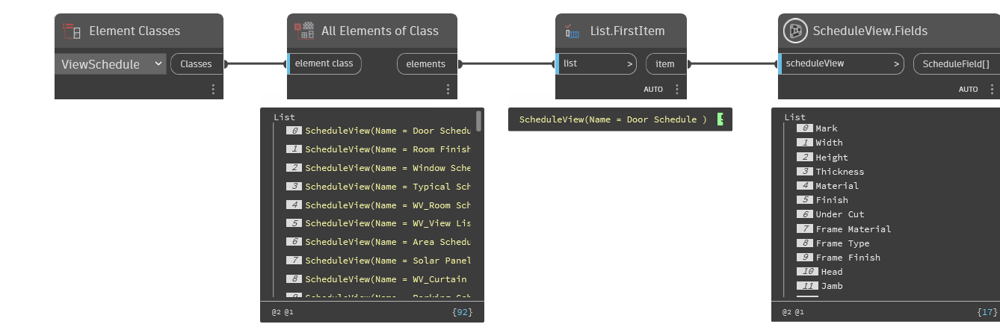

## In Depth
`ScheduleView.Fields` retrieves all the fields assigned to the given schedule view.

In the example below, a door schedule is collected from the current Revit file and the fields are reported.
___
## Example File

