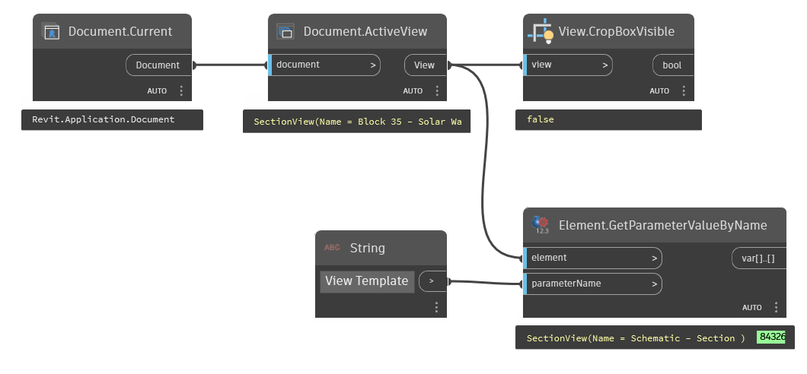

## In Depth
`View.CropBoxVisible` checks whether or not the Crop Box/Region is visible for the view. Crop boxes can be hidden in Revit in visibility graphics (by filter, or category), or hidden by instance in the view. This property can also be controlled by a view template.

In the example below, the active view is checked to see if the crop box is visible. Additionally, the active view is checked for a view template.
___
## Example File

