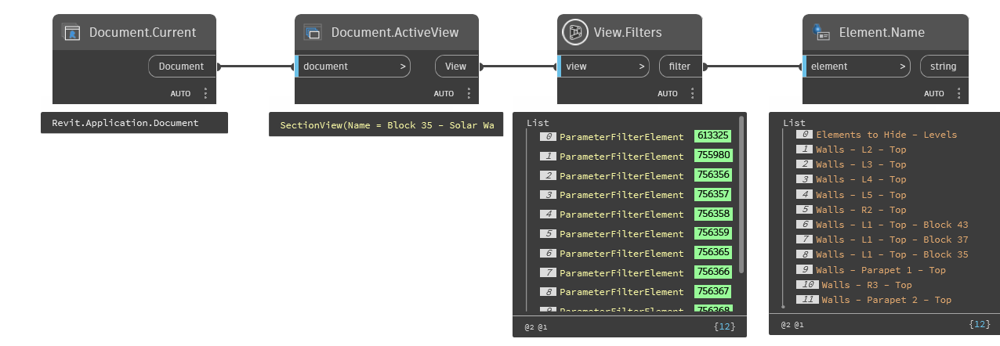

## In Depth
`View.Filters` obtains the view filters assigned to the view as `ParameterFilterElement` objects.

In the example below, the name of the filters applied to the active view is returned.
___
## Example File

