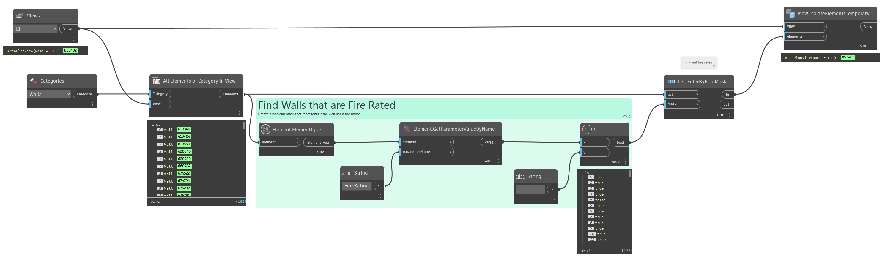

## In Depth
`View.IsolateElementsTemporary`  enables the temporary hide/isolate view mode for the given view. The given elements are isolated until the temporary hide/isolate view mode is reset.

In the example below, all walls for view "L1" are collected and split into two list, fire rated and non-rated. The non-rated walls are temporarily isolated with `View.HideElementsTemporary`.
___
## Example File

