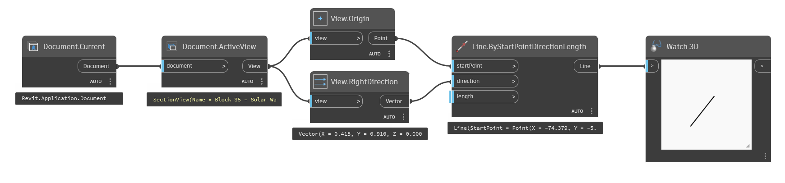

## In Depth
`View.RightDirection` returns a vector representing the views orientation to the right side of the screen.

In the example below, the vector of the view right direction is visualized with a line.
___
## Example File

