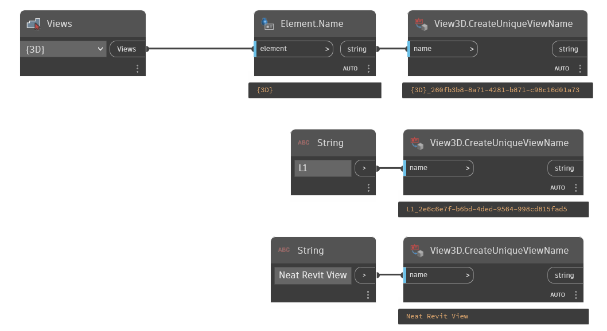

## In Depth
`View3D.CreateUniqueViewName` determines whether a view with the provided name already exists. If a view exists with the provided name, a new view is created with a unique name. Otherwise, the original view name is returned.

This node can also be used with a simple string input to generate fully unique strings for any element creation.

In the example below, a unique view name is generated from a selected 3D view, a unique view name is also generated from a string entry, and an already unique view name is proved to be unique.
 
___
## Example File

