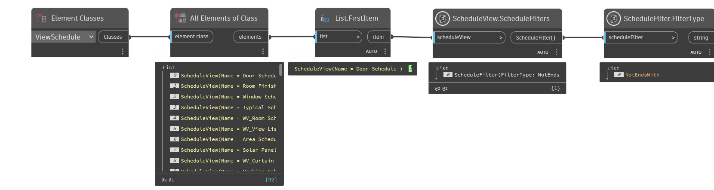

## In Depth
`ScheduleFilter.FilterType` returns the method used for the input filter.
Possible filter types include:

- Equal - The field value is equal to the specified value.
- NotEqual - The field value is not equal to the specified value.
- GreaterThan - The field value is greater than the specified value.
- GreaterThanOrEqual - The field value is greater than or equal to the specified value.
- LessThan - The field value is less than the specified value.
- LessThanOrEqual - The field value is less than or equal to the specified value.
- Contains - For a string field, the field value contains the specified string.
- NotContains - For a string field, the field value does not contain the specified string.
- BeginsWith - For a string field, the field value begins with the specified string.
- NotBeginsWith - For a string field, the field value does not begin with the specified string.
- EndsWith - For a string field, the field value ends with specified string.
- NotEndsWith - For a string field, the field value does not end with the specified string.
- IsAssociatedWithGlobalParameter - The field is associated with a specified global parameter of a compatible type
- IsNotAssociatedWithGlobalParameter - The field is not associated with a specified global parameter of a compatible type 

In the example below, the first schedule from the current Revit file is collected. The schedule view is then checked for filters, and the only filter applied is a "string does not end with" filter type.
___
## Example File

