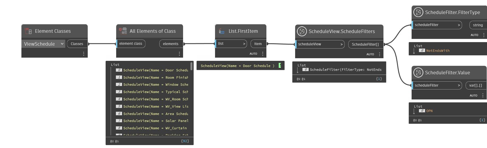

## In Depth
`ScheduleFilter.Value` returns the value assigned to the given filter.

In the example below, a filter is applied to a door schedule that only displays elements, if the elements do not end with "OPN".
___
## Example File

