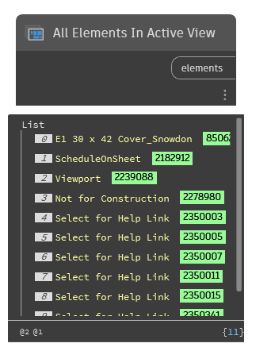

## In Depth
`All Elements In Active View` returns all of the elements that are visible in the active view of the current Revit document.

`All Elements In Active View` will update on as the view changes in Revit, resulting in a new list.

In the example below, 11 elements are returned for the starting view of the Revit architectural sample file, _(Snowdon Towers)_.
___
## Example File

