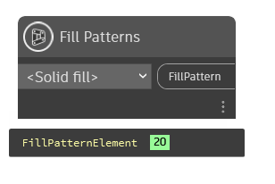

## In Depth
`Fill Patterns` allows for the selection of a fill pattern from all available fill patterns in the current Revit document.

In the example below, the "<Solid Fill>" drafting fill pattern is returned for the current Revit document. 
___
## Example File

