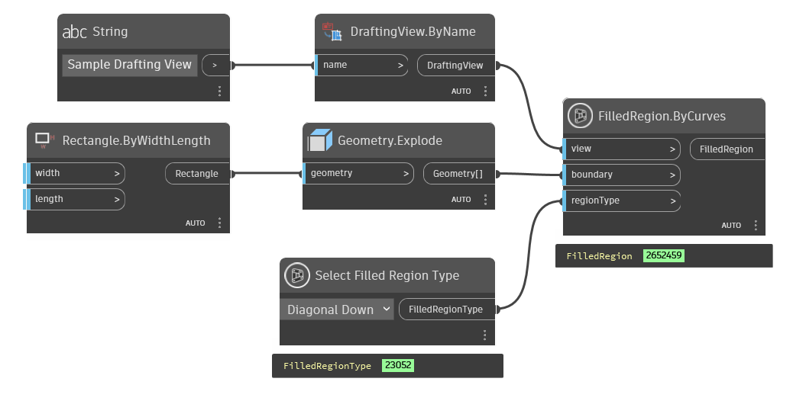

## In Depth
`Select Filled Region Type` allows for the selection of a filled region type from all types available in the active Revit document.

In the example below, a new drafting view is created in the active Revit document. A filled region is constructed in the view of the "Diagonal Down" type.

___
## Example File

