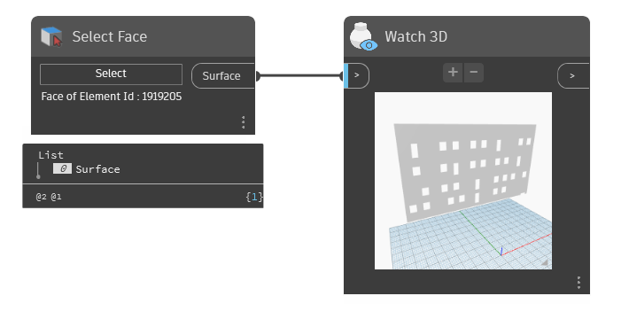

## In Depth
`Select Face` is a user interface node that provides a single selection of a face of a Revit element.

In the example below, a wall face is selected in Revit and the corresponding surface geometry is returned. Additionally, `Select Face` reports the owning element id of the face that is selected.
___
## Example File

