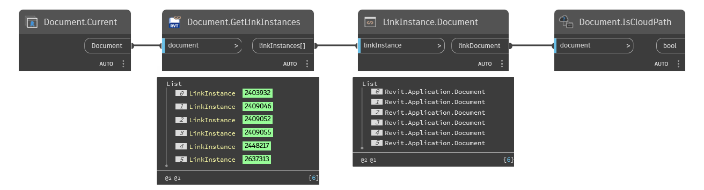

## In Depth
`Document.IsCloudPath` returns a boolean indicating whether or not the given Revit document is hosted on a cloud location. A null value is returned for a non-workshared file.

In the example below, all Revit link instances are collected from the current Revit document. The link instances' documents are then checked if they are a cloud path.
___
## Example File

