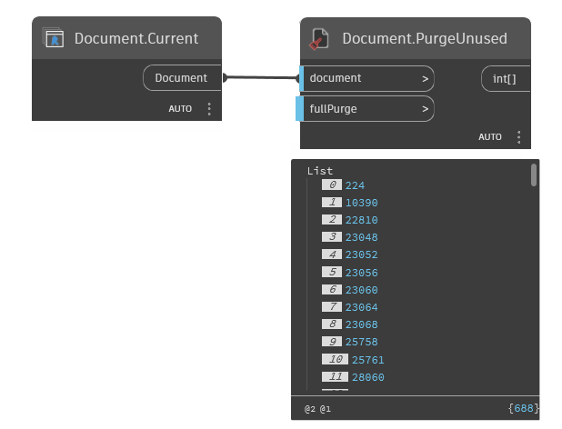

## In Depth
`Document.PurgeUnused` purges elements that are not used from the current Revit document. `Document.PurgeUnused` includes a "Full Purge" option which mimics performing a purge unused in the Revit UI multiple times. 

In the example below, all unused elements are purged from the current Revit document.
___
## Example File

