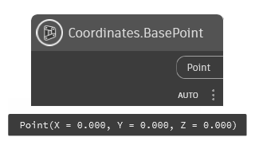

## In Depth
`Coordinates.BasePoint` returns the project base point as a point geometry. The project base point is set in Revit and can differ from project to project. For more on the project base point in Revit, visit this [help article](https://help.autodesk.com/view/RVT/2025/ENU/?guid=GUID-30D76259-CC67-4498-B06B-91F7517F9B65).

In the example below, the project base point is returned.

___
## Example File

