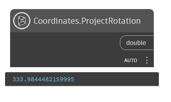

## In Depth
`Coordinates.ProjectRotation` returns the project rotation in degrees. Project rotation is a user modifiable value and can differ greatly. For more on project rotation in Revit, visit this [help article](https://help.autodesk.com/view/RVT/2025/ENU/?guid=GUID-C240FF71-D7D4-42C0-981C-4931C7A5E50C).

In the example below, the project rotation value is returned.

___
## Example File

