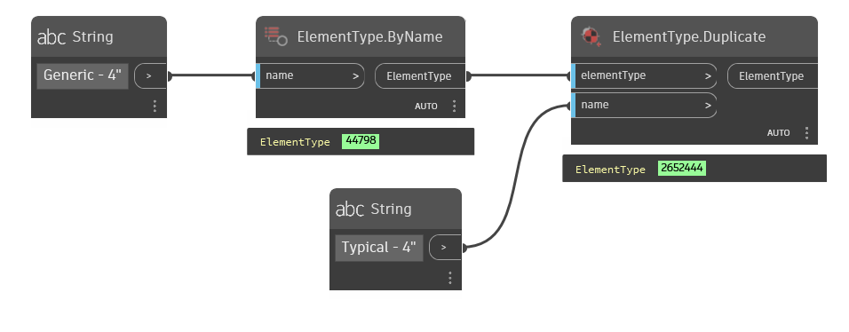

## In Depth
`ElementType.Duplicate` attempts to duplicate the given element with the given name. If the name is already taken an error will be presented on the node.

In the example below, the wall type `Generic - 4"` is retrieved from the current Revit document. The wall type is then duplicated with the name `Typical - 4"`.
___
## Example File

