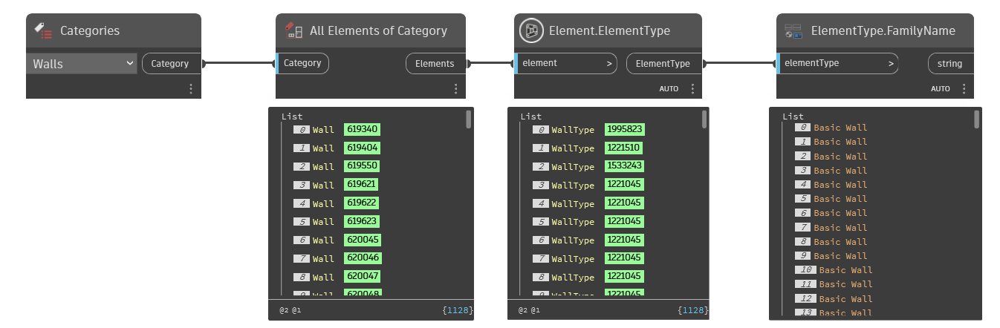

## In Depth
`ElementType.FamilyName` returns the name of the owning family of the given element.

In the example below, all walls are collected from the current Revit document. The wall types are then returned for each wall and the family name is returned. .
___
## Example File

