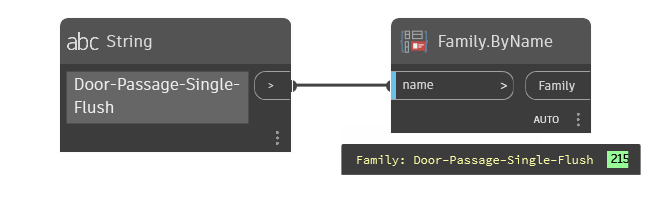

## In Depth
`Family.ByName` returns the family definition from the current document (if available). If the family is not available in the current document, a null value is returned.

In the example below, a family definition for "Door-Passage-Single-Flush" is returned.
___
## Example File

