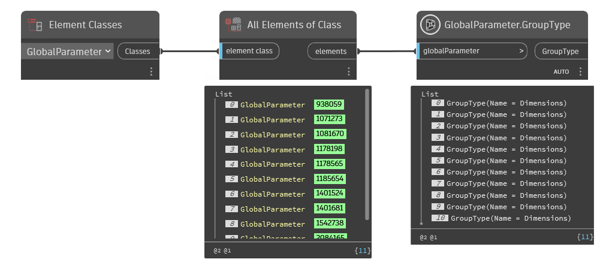

## In Depth
`GlobalParameter.GroupType` returns the group type for the given parameter. Information regarding group types can be found in the documentation located, [here](https://help.autodesk.com/view/RVT/2025/ENU/?guid=Revit_API_Revit_API_Developers_Guide_Introduction_Application_and_Document_Units_html).

In the example below, all global parameters are returned from the current Revit document. The group types are then returned with `GlobalParameter.GroupType`.
___
## Example File

