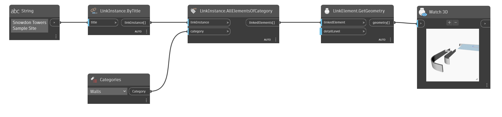

## In Depth
`LinkElement.GetGeometry` returns the geometry of the given link elements at the optional detail level.

In the example below, the geometry for all toposolid elements in the "Snowdon Towers Sample Site` link is returned.
___
## Example File

