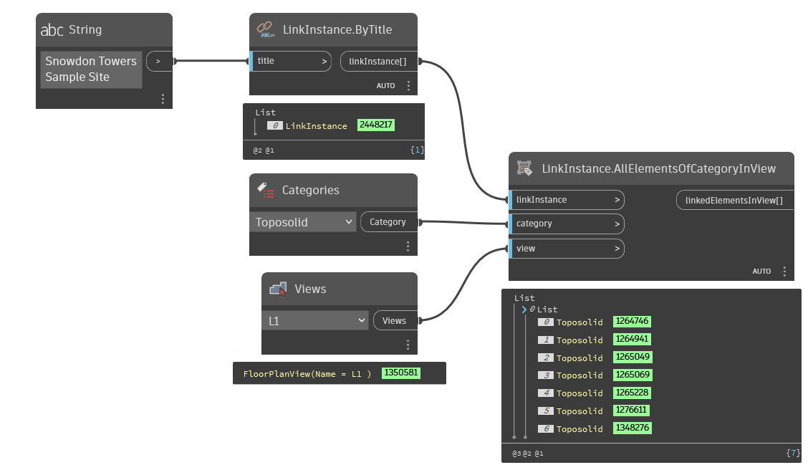

## In Depth
`LinkInstance.AllElementsOfCategoryInView` returns all elements of the given category in the given view from the current Revit document.

In the example below, the all toposolids in the "Snowdon Towers Sample Site` that are visible in floor plan "L1" are returned.
___
## Example File

