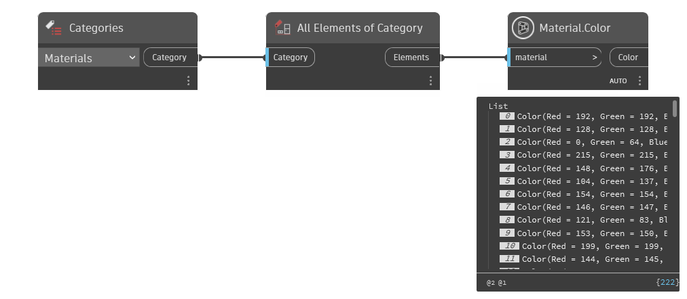

## In Depth
`Material.Color` returns a Dynamo color that represents the material's cut pattern color (if available).

In the example below, all materials are collected from the current document. The materials' colors are returned with `Material.Color`.

___
## Example File

