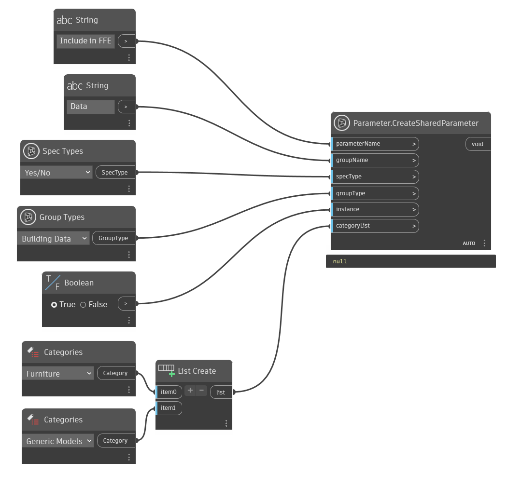

## In Depth
`Parameter.CreateSharedParameterForAllCategories` will add a parameter with the given values to the given categories in the current Revit document.

In the example below, a shared Yes/No parameter called "Include in FFE" is added to the furniture and generic model categories in the current Revit document.
___
## Example File

