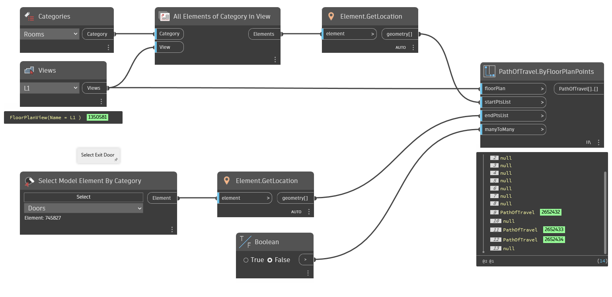

## In Depth
`PathOfTravel.ByFloorPlanPoints` creates path of travel elements in the current Revit document and given floor plan view between the given start and end points. Note: a null value will be returned if a path of travel element cannot be constructed.

In the example below, all rooms are collected from plan view "L1". Paths of travel are then constructed between the rooms and a selected exterior door.
___
## Example File

