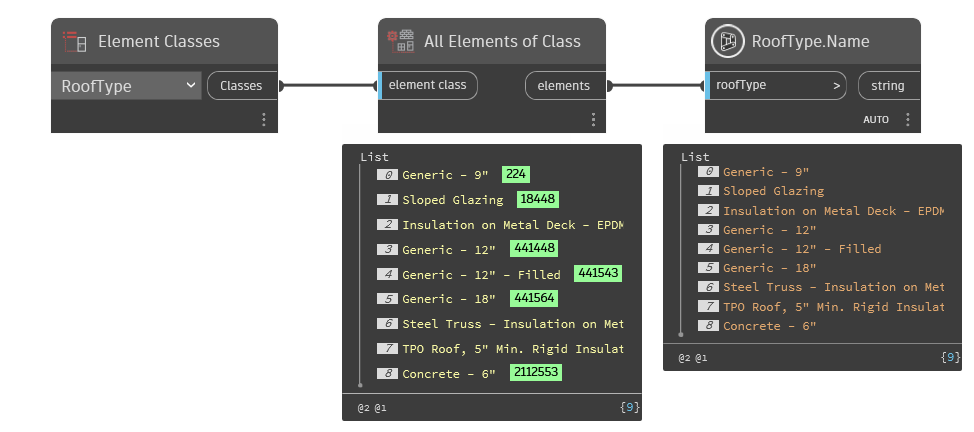

## In Depth
`RoofType.Name` returns the name of the given roof type.

In the example below, all roof types are collected for the current Revit document. The names of the roof types are returned with `RoofType.Name`.
___
## Example File

