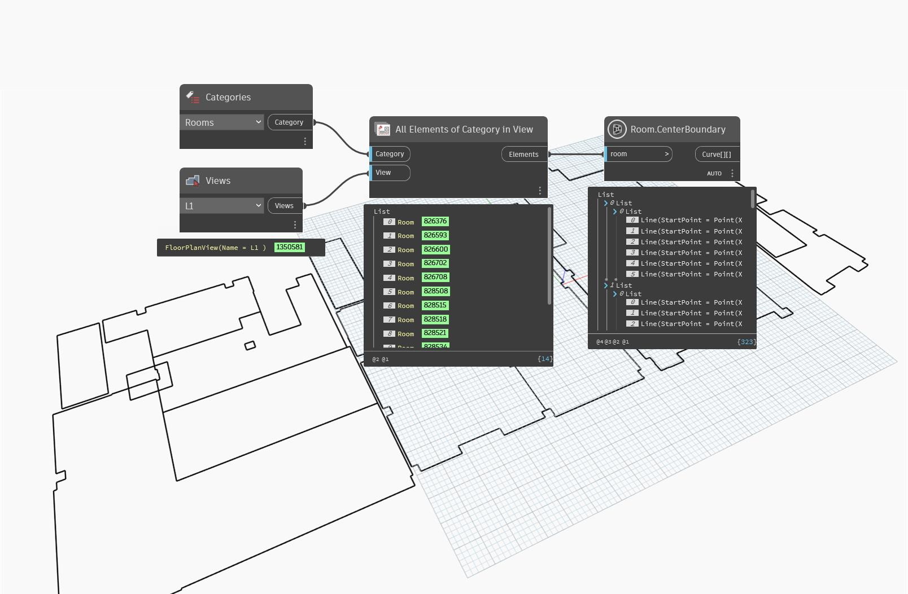

## In Depth
`Room.CenterBoundary` returns a nested list representing the given room's centerline boundary. In the returned list, the first sublist represents the outermost curves, while subsequent lists represent loops within the room. Center boundaries occur on Revit rooms on the wall's centerline of all layers.

If an unbounded or unplaced room is given, a null value is returned.

In the example below, all rooms are collected from the current document and selected view. The center boundaries are then returned.
___
## Example File

