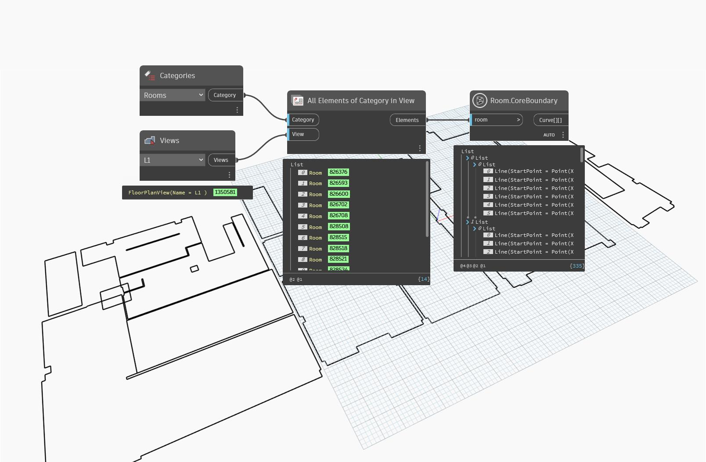

## In Depth
`Room.CoreBoundary` returns a nested list representing the given room's core boundary. In the returned list, the first sublist represents the outermost curves, while subsequent lists represent loops within the room. Core boundaries occur on Revit rooms on the wall's section that is defined as core.

If an unbounded or unplaced room is given, a null value is returned.

In the example below, all rooms are collected from the current document and selected view. The core boundaries are then returned.
___
## Example File

