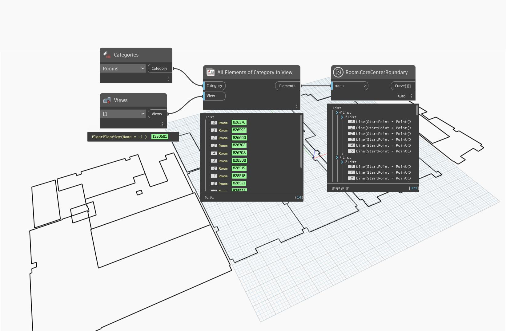

## In Depth
`Room.CoreCenterBoundary` returns a nested list representing the given room's core center boundary. Core center boundaries occur on Revit rooms on the wall's section that is defined as core.

If an unbounded or unplaced room is given, a null value is returned.

In the example below, all rooms are collected from the current document and selected view. The core center boundaries are then returned.
___
## Example File

