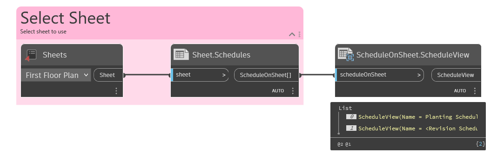

## In Depth
The `ScheduleOnSheet.ScheduleView` node in Dynamo for Revit is used to retrieve the original schedule view that was used to create the specific schedule instance on a sheet.

In the example below, the schedule instances are returned for the selected sheet. The revision schedules are then filtered out with `List.FilterByBoolMask`. Additionally, the owner view for the schedule instance is retrieved with `ScheduleOnSheet.ScheduleView`.
___
## Example File

