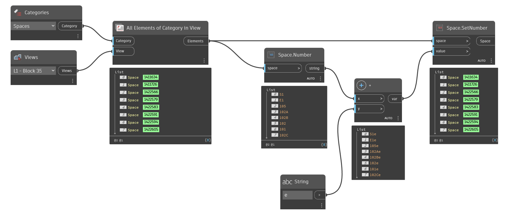

## In Depth
`Space.SetNumber` modifies the number of the given space element.

In the example below, all spaces are collected from the current document from the selected view. The spaces' numbers are then modified with a suffix of "e" to indicate existing conditions. This type of workflow is useful when working through space renumbering in Revit.
___
## Example File

