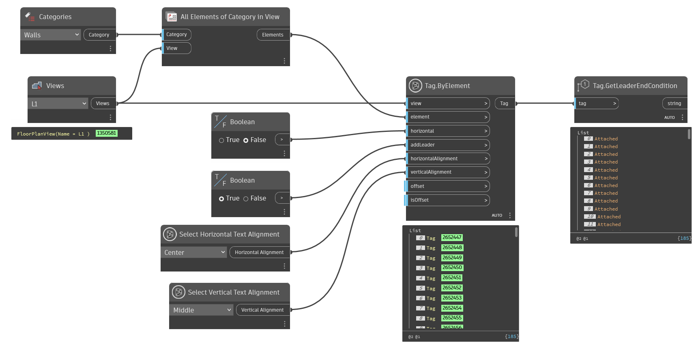

## In Depth
`Tag.GetLeaderEndCondition` returns the given tag element's leader end condition.

In the example below, all walls are collected from the given view. The walls are then tagged with the default wall tag type and alignment/leader criteria. The end conditions are then returned with `Tag.GetLeaderEndCondition`.
___
## Example File

