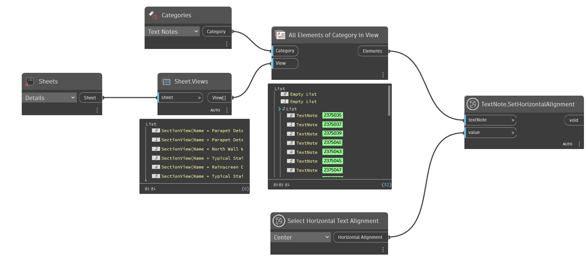

## In Depth
`TextNote.SetHorizontalAlignment` sets the horizontal alignment of the given text note.

Note: this node has a return type of void, which means the node commits an action on an element and returns null.

In the example below, a sheet of details is selected. All text notes in the detail views are then collected and their horizontal alignment is set to center.
___
## Example File

