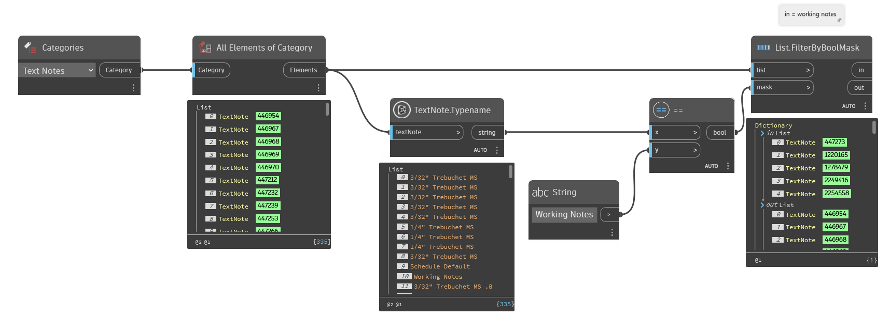

## In Depth
`TextNote.Typename` returns the type name for the given text note.

In the example below, all working text notes are collected from the current Revit document by filtering by the text note type name. 

___
## Example File

