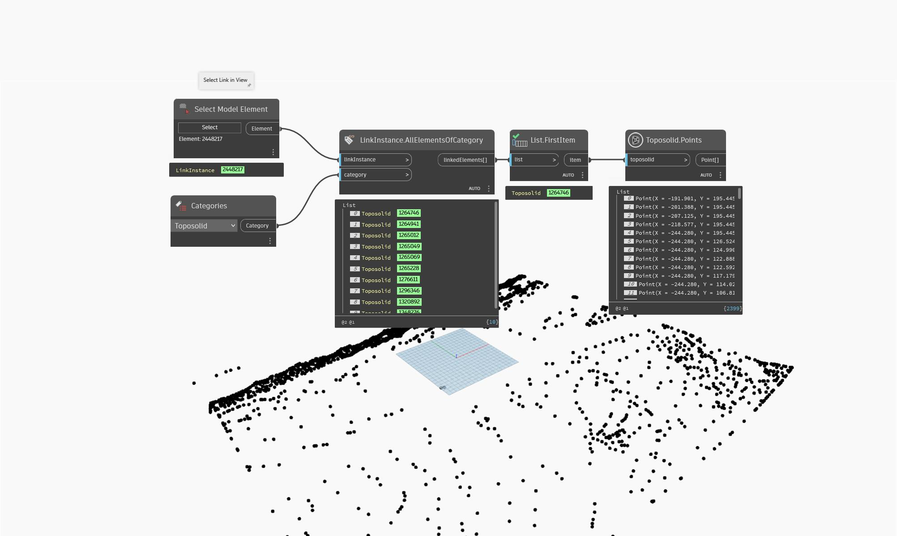

## In Depth
`Toposolid.Points` returns the shape edited points of the given toposolid, if available.

In the example below, all points are returned from the first toposlid found on the selected Revit link.
___
## Example File

