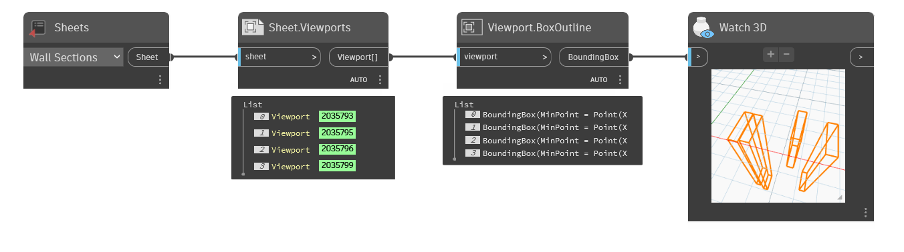

## In Depth
`Viewport.BoxOutline` returns a Dynamo bounding box that represents the extents of the viewport.

Note, despite a viewport existing in 2d space on a Revit sheet, there are 3d extents returned via `Viewport.BoxOutline`. The 3d extents represent the view range of the view. For more information about view range, refer to this [article](https://help.autodesk.com/view/RVT/2025/ENU/?guid=GUID-58711292-AB78-4C8F-BAA1-0855DDB518BF).

In the example below, the viewports are returned for the selected sheet. The box outlines are then returned with `Viewport.BoxOutline`.
___
## Example File

