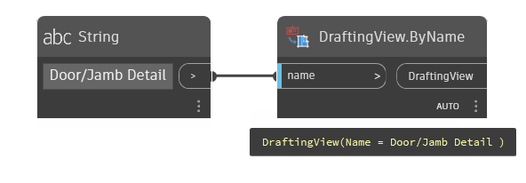

## In Depth
`DraftingView.ByName` creates a drafting view with the given name. The type of drafting view used is the last one used within Revit.

In the example below, a drafting view called "Door/Jamb Detail" is created.
___
## Example File

