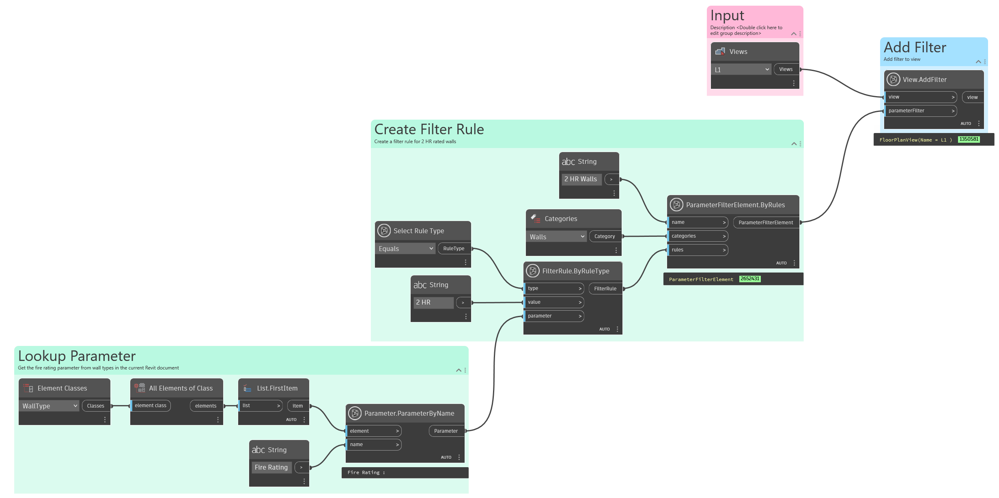

## In Depth
`View.AddFilter` adds the specified filter to the given view. If the view has a view template applied, this node will add the filter to it's view template.

In the example below, a view filter is created for the `Fire Rating` parameter on wall type elements. This filter is added to the `L1` floor plan view in the sample model. After the filter is added, overrides are then added to the filter to turn the wall types with a "2 HR" rating to a solid red color.
___
## Example File

