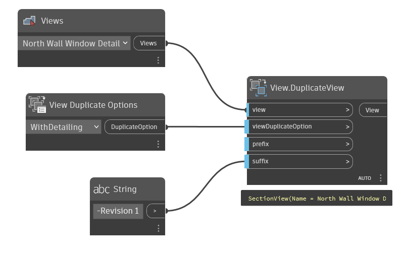

## In Depth
`View.DuplicateView` attempts to duplicate the given view with the given duplication options and optional prefix or suffix.

In the example below, the detail view "North Wall Window Detail" is duplicated with a prefix of "-Revision 1".
___
## Example File

