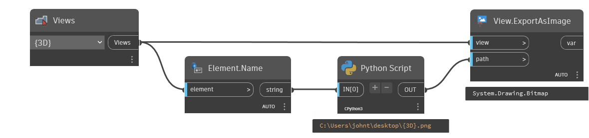

## In Depth
`View.ExportAsImage` exports the given view to the given path as an image.

In the example below, the default 3d view from the current document is selected for export. The path is composed by extracting the "Pictures" folder from the current user's machine, combined with the view name.
___
## Example File

